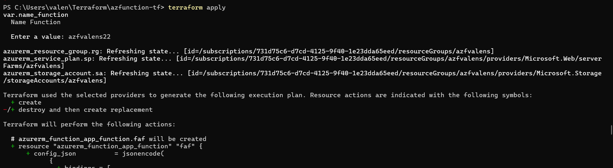
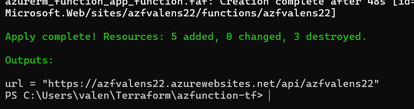
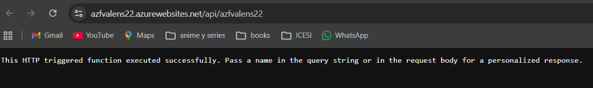
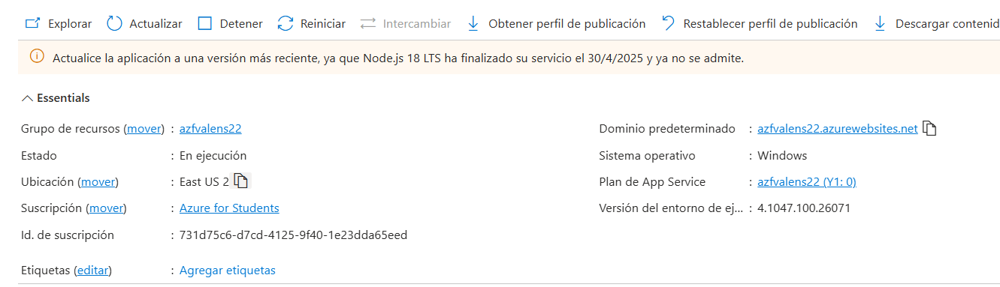
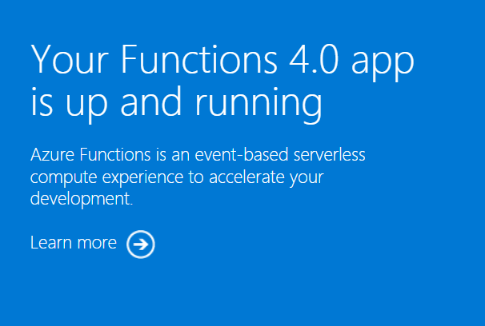

**Laboratory report**
In this laboratory activity, the main objective was to work with Infrastructure as Code (IaC) concepts and apply them in a cloud environment using Microsoft Azure. To accomplish this, the necessary tools were installed, mainly Terraform and Azure CLI, which allow the management and deployment of cloud resources from the command line in an automated and repeatable way.

Infrastructure as Code is an approach that makes it possible to define and manage infrastructure through code files instead of manual configuration. This provides several advantages, such as repeatability, version control, automation, and easier maintenance. In addition, it helps ensure that different environments can be created in a consistent manner by reusing the same configuration with only minor parameter changes.

First, the required tools were installed and configured to work with Microsoft Azure. Terraform was used as the infrastructure provisioning tool, while Azure CLI was used to authenticate and interact with the Azure platform.

After that, the repository provided by the instructor was cloned. This repository contained the Terraform configuration files needed to deploy an Azure Function along with the associated resources required for its operation. The project structure included the necessary .tf files to define the infrastructure in a modular and organized way.

Once inside the project directory, the command terraform init was executed. This command initializes a Terraform working directory, downloads the required provider plugins, and prepares the environment for infrastructure deployment. In this case, the Azure provider was downloaded so Terraform could communicate with Microsoft Azure services properly.

After initialization, the command terraform apply was run. This command reads the Terraform configuration files, analyzes the resources defined in them, and shows a plan of the infrastructure that will be created in Azure. Before applying the changes, Terraform requested the value of the parameter name_function, which corresponds to the name assigned to the function and related resources. In this practice, the value azfvalens22 was entered.

Once the value was provided, Terraform created the required resources automatically. This included the components necessary for the Azure Function to run correctly. The process demonstrated how Terraform can simplify cloud provisioning by reducing manual work and ensuring that the deployment follows the same configuration every time it is executed.

After the infrastructure was deployed, Terraform displayed an automatically generated URL in the console. This URL was defined in the outputs.tf file, which is used to show relevant output values after the deployment process is completed. In this case, the output corresponded to the access address of the Azure Function.

The function was tested directly from the browser by opening the generated URL. The response confirmed that the function was working correctly, which meant that the deployment had been successful and the application was available through the web

Later, the Azure portal was accessed in order to verify the created resources. It was possible to confirm that the infrastructure had been deployed successfully and that all the required services were active inside the Azure environment. This verification step was important because it allowed the deployment to be checked not only from Terraform, but also directly from the cloud platform.

Finally, the domain of the Azure Function App was accessed. The default page indicating that the Azure Functions application was running was displayed, confirming that the service was active and properly configured in Azure.

This practice showed the importance of using Infrastructure as Code in cloud environments. Instead of configuring resources manually, Terraform allowed the infrastructure to be defined in code, making the deployment faster, more organized, and easier to reproduce. This approach also improves traceability because every change can be tracked through the code.

Another relevant aspect of the practice was the use of variables. By requesting the name_function parameter during deployment, Terraform demonstrated how infrastructure can be customized without modifying the main configuration files directly. This is useful for creating reusable and flexible deployments.
